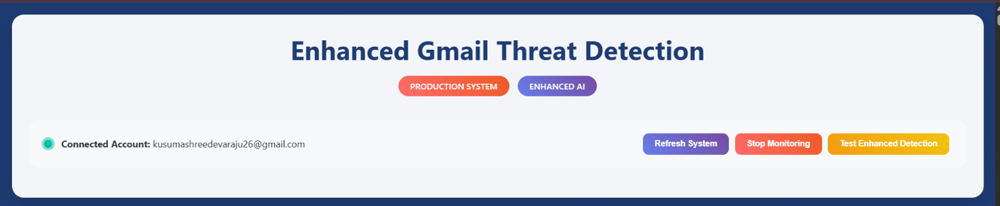
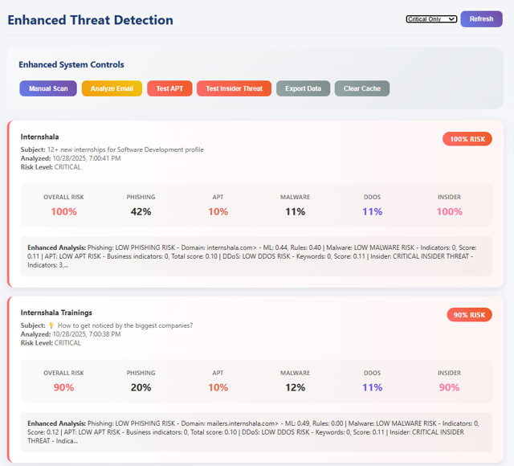

# 🛡️ Real-Time AI-Powered Cybersecurity Threat Detection System

An AI and Machine Learning-based cybersecurity system designed to analyze emails and detect potential cyber threats using intelligent threat-analysis techniques.

## 📌 Project Overview

This project focuses on automated email threat detection and analysis. It analyzes email content and identifies potential security threats such as phishing, malware, Advanced Persistent Threats (APT), DDoS-related indicators, and insider threats.

The system integrates Gmail for email processing, SQLite for storing analysis results, and a web-based dashboard for monitoring threats.

## ✨ Key Features

- 📧 Gmail email integration
- 🔍 Phishing detection
- 🦠 Malware detection
- 🎯 APT detection
- 🌐 DDoS threat detection
- 👤 Insider threat detection
- 🤖 AI/ML-based threat analysis
- 📊 Risk and confidence assessment
- 💾 SQLite database storage
- 🖥️ Web-based threat monitoring dashboard
- 🧪 Threat detection testing

## 🛠️ Technologies Used

- Python
- Machine Learning
- Natural Language Processing (NLP)
- Scikit-learn
- Pandas
- NumPy
- Flask
- Gmail API
- SQLite
- HTML
- CSS
- JavaScript
- Git & GitHub

## 🏗️ System Workflow

Gmail  
↓  
Email Collection  
↓  
Email Preprocessing  
↓  
AI/ML Threat Analysis  
↓  
Phishing | Malware | APT | DDoS | Insider Threat Detection  
↓  
Risk Assessment  
↓  
SQLite Database  
↓  
Web Dashboard

## 📂 Project Files

| File | Description |
|---|---|
| `gmail_threat_detector.py` | Main threat detection and email analysis code |
| `production_dashboard.html` | Web dashboard for monitoring and testing |
| `install.py` | Project installation and setup script |
| `run.py` | Project execution file |
| `test_system.py` | System testing file |
| `requirements.txt` | Required Python dependencies |
| `.gitignore` | Files excluded from GitHub |

## 📸 Project Screenshots

### Cybersecurity Dashboard

### Threat Detection

### Results Screen

